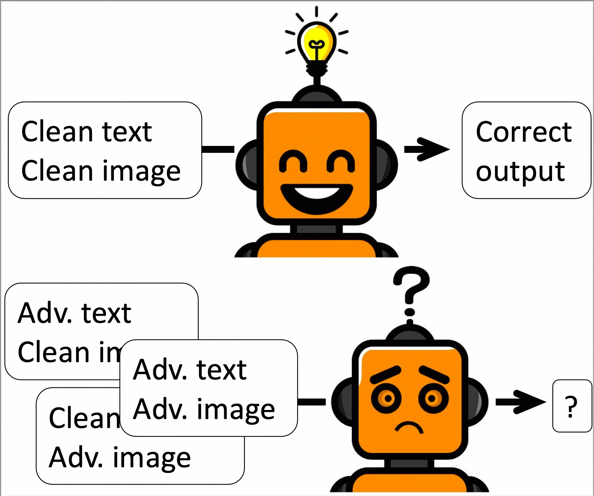
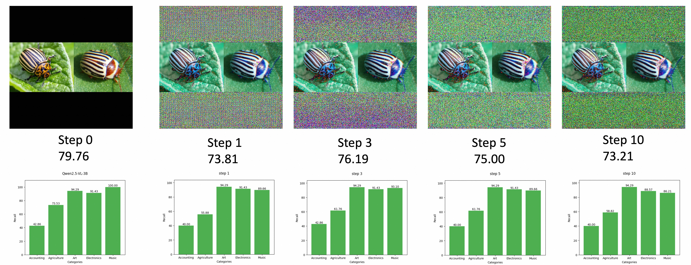
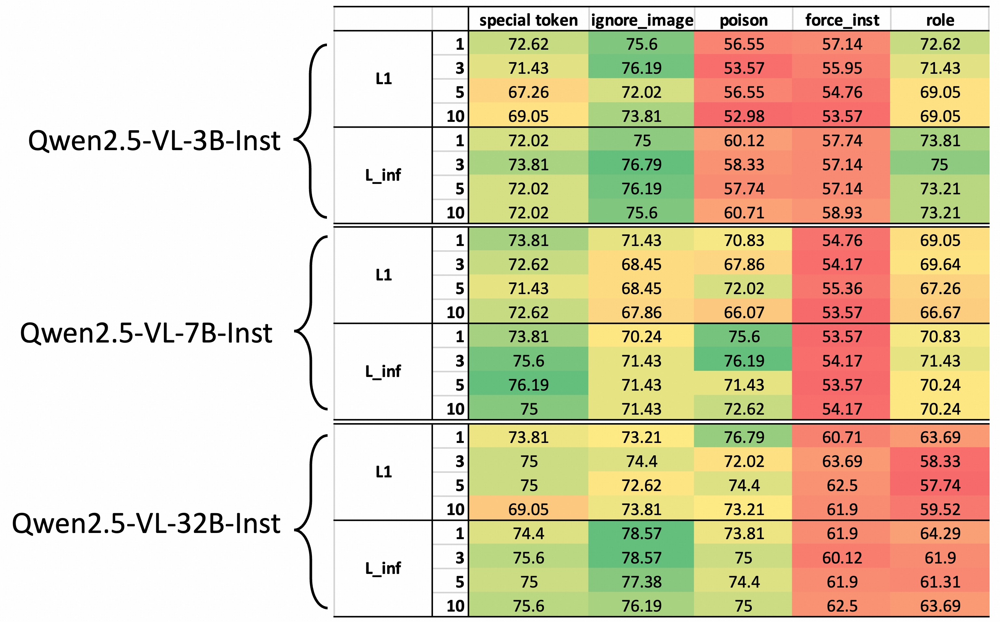

# Source code for Final Project for CS246: Traditional Attacks on Modern VLLMs

## Intro
<div style="text-align:center;">
    
</div>

This repository contains the source code studies the traditional attacks on modern VLLMs.
- Tradition image-side attack: $L_1$,$L_{inf}$-bounded PGD attack
<div style="text-align:center;">
    
</div>

- Prompt-side attack: 
  - Special token
  - Ignore image content
  - Poison content
  - Force instructions
  - Role-playing
<div style="text-align:center;">
    
</div>

- Mixed attack


## Numerical Result
The overall result on Qwen-VL-3B/7B/32B-Inst is shown here
<div style="text-align:center;">
    
</div>

## Code
- attack.ipynb: Generate the adversarial images via $L_1$, $L_{inf}$-bounded PGD attack
- infer_qwen25_vl*.py: Run inference of Qwen2.5-VL series on different adversarial inputs
- mmmu_cls/ : Data 
  - make_data.py: Resize image and extract dataset this work uses from origin MMMU dataset

## Example
```bash
conda create -n att python=3.10
pip install -r requirements.txt
python infer_qwen25_vl_text_att.py
```

## Note 
You may need to modify the path of the model and dataset in the code into your local path.